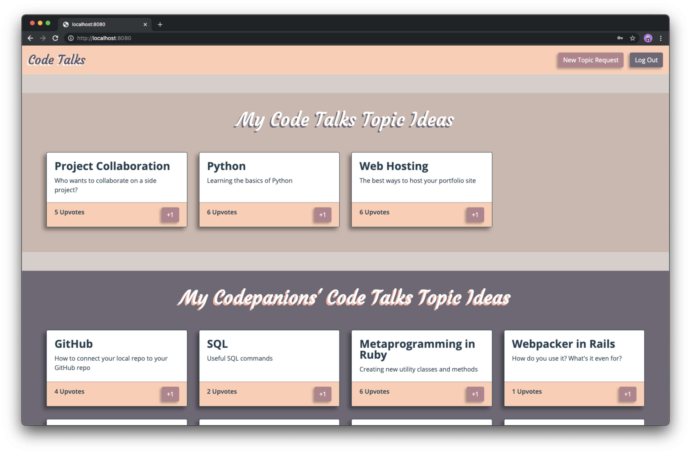
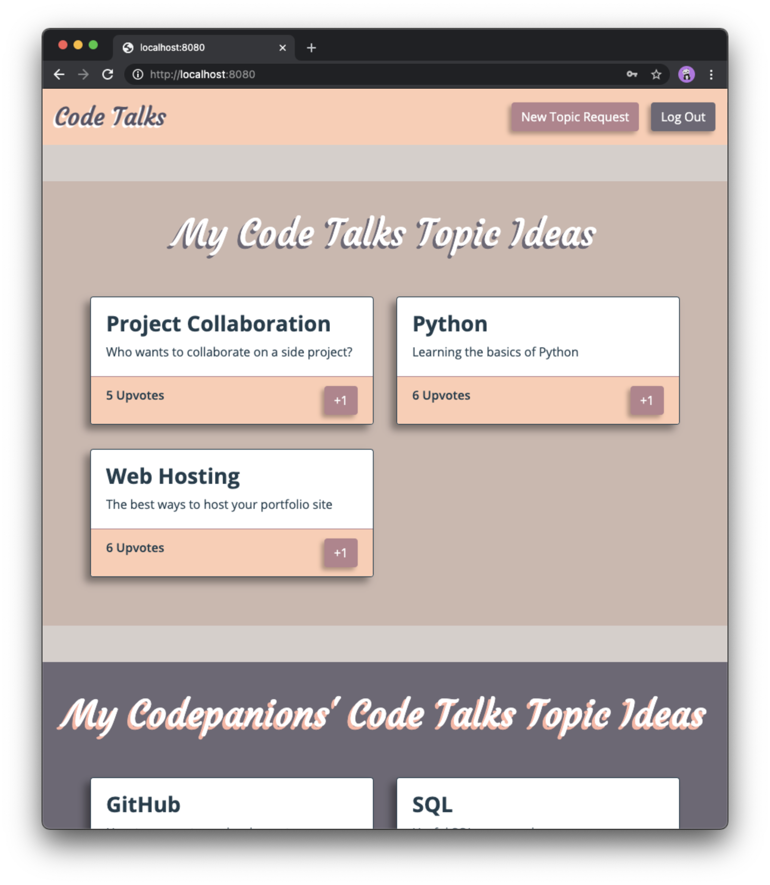

# Code Sample for Azavea

## A bit about the sample code

I have selected a portion of my web app that I put through some major refactoring and was particularly proud to show off once it was complete! I have included a few files in this repository to give context to my refactored function (`renderTopicRequests` located in `src/models/topicRequest.js`), and have added code comments to the files as well. Quick, concise clarity is my goal!

I suggest reading through the `src/entry.js` file first and then moving on to the `src/models/topicRequest.js` file. I included bits from my `src/services/domElements.js` and `template.html` files in case you're curious about the syntax used in my `src/entry.js` file.

## The original project: Code Talks Topic Request Platform

### Screen shots

Here are screen shots to help orient you and give context to the code you'll be reading:

### Demo

You're welcome to <a href="https://youtu.be/z1_PU_QzOJI" target="_blank">view a demo video of the full app</a>! It's a little over 7 minutes long.

### Summary

This web app was designed to be used within a community of learning developers to create study group topic requests. Each topic request consists of a brief idea (similar to a git commit message) and an optional longer description that elaborates on that idea. Once submitted, the request is then rendered as a card on a dashboard available for other learners in the community to view and upvote. As the topic request's upvote count increases, it rises in the ranks of popularity and becomes a more likely candidate to be converted into a study session by the community's instructors.
